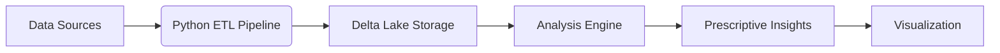

# 🔍 KPI Quantum: Python-Powered Performance Intelligence System

[](LICENSE)
[](https://www.python.org/)
[](https://colab.research.google.com/github/wenholma/kpi-quantum)

Advanced performance intelligence system that transforms KPIs into actionable insights using Python-powered analytics, NLP, and predictive modeling.


## 📖 Project Overview
KPI Quantum is an integrated performance intelligence system that:
- Diagnoses KPI health using multidimensional scoring
- Predicts performance variances using machine learning
- Aligns strategy with execution through NLP analysis
- Maintains self-documenting data dictionaries
- Incorporates resident sentiment into performance analysis

## 🚀 Key Features
- **KPI Diagnosis Matrix**: Dynamic performance scoring (0-100) with AI-powered insights
- **Predictive Variance Advisor**: Identifies key drivers of performance gaps
- **Strategy-Execution Matcher**: NLP-powered alignment of operations with strategic goals
- **Living Data Dictionary**: Automated data documentation
- **Resident Voice Intelligence**: NLP analysis of public sentiment

## ⚙️ Technical Architecture


## 📊 Integrated Components
1. **KPI Diagnosis Matrix**
   ```python
   def diagnose_kpi(target, actual, trend, benchmark):
       variance = 80 - abs(target - actual)*10
       trend_score = 20 * (1 if trend[-1] > trend[0] else -1)
       benchmark_score = 20 if actual > benchmark else 0
       return variance + trend_score + benchmark_score
   ```

2. **Resident Voice Intelligence (NLP)**
   ```python
   from textblob import TextBlob
   import spacy
   
   def analyze_feedback(text):
       doc = nlp(text)
       sentiment = TextBlob(text).sentiment
       return {
           'sentiment': sentiment.polarity,
           'intensity': sum([t.sentiment for t in doc])/len(doc)
       }
   ```

3. **Predictive Variance Advisor**
   ```python
   from sklearn.ensemble import RandomForestRegressor
   
   model = RandomForestRegressor()
   model.fit(X_train, y_train)
   explanations = model.explain(current_metrics)
   ```

## 📂 Repository Structure
```
kpi-quantum/
├── data/                   # Stats NZ income datasets
├── notebooks/              # Jupyter notebooks
│   ├── KPI_Diagnosis.ipynb
│   ├── Resident_Voice_Analysis.ipynb
│   └── Strategy_Alignment.ipynb
├── src/                    # Core Python modules
│   ├── diagnostics.py
│   ├── nlp_processor.py
│   └── variance_advisor.py
├── outputs/                # Generated reports and visualizations
├── docs/                   # Technical documentation
├── .gitignore
├── LICENSE
├── requirements.txt
└── README.md
```

## 🧪 Methodology
### Data Integration
- **Data Sources**: Stats NZ income datasets (13 files, 1960-2023)
- **Processing**: 
  - Automated ETL pipeline with error handling
  - Schema validation
  - Temporal alignment

### Analytical Approach
1. **KPI Health Scoring**:
   - Variance analysis
   - Trend assessment
   - Benchmark comparison

2. **Resident Sentiment Integration**:
   - NLP-powered survey analysis
   - Sentiment-intensity scoring
   - Service impact mapping

3. **Predictive Modeling**:
   - Random Forest regression
   - SHAP value explanations
   - Intervention impact simulation

## 🚀 Getting Started

### Installation
```bash
git clone https://github.com/wenholma/kpi-quantum.git
cd kpi-quantum
pip install -r requirements.txt
```

### Running Analysis
1. KPI Diagnosis:
```python
python src/diagnostics.py --kpi="Building_Consents" --target=85 --actual=80
```

2. Resident Voice Analysis:
```python
python src/nlp_processor.py --survey="resident_feedback.csv"
```

3. Strategy Alignment:
```python
python src/strategy_matcher.py --strategy="strategic_plan.pdf" --operations="annual_report.docx"
```

## 📊 Sample Output
### KPI Diagnosis Report
```
🏥 KPI DIAGNOSIS: Building Consents Processing
--------------------------------------------------
| PERFORMANCE HEALTH: 68/100 - MODERATE CONCERN  |
--------------------------------------------------
🔍 Variance Analysis:
- Missed target by 5% (Significant)
- Trend: ▼ Deteriorating (82 → 80)
- Benchmark: ✓ Exceeds national average (75%)
🚑 PRESCRIPTION:
1. Process Bottleneck Scan
2. Resource Reallocation
3. Predictive Alert System
```

### Resident Voice Analysis
```
🔍 RESIDENT VOICE ANALYSIS: Harbour City
--------------------------------------------------
SENTIMENT: -0.82 (Strong Negative)
TOP ISSUES:
1. Library hours (Priority: 92)
2. Potholes (Priority: 87)
SERVICES IMPACTED:
- Community Services
- Transport
```

## 📜 License
This project is licensed under the MIT License - see [LICENSE](LICENSE) for details.

## 📬 Contact
**Marece Wenhold**  
https://www.linkedin.com/in/marecewenhold/


